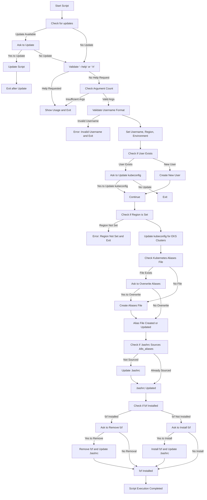
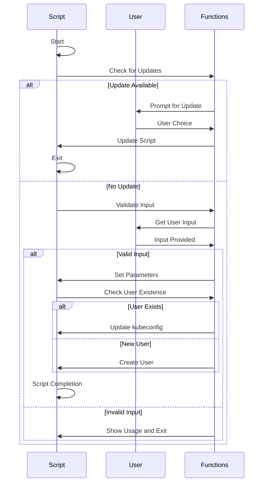

# Mezeze

## Overview
Mezeze is a Bash script designed for AWS and Kubernetes environment management, including automated user creation, AWS CLI configuration, kubeconfig updates, kubectl aliases setup, and fzf installation.
## Features

### Script Functionalities
- **User Creation and Setup:** Automates the creation of a new user and configures their environment for AWS and Kubernetes.
- **AWS CLI Configuration:** Sets up the AWS CLI for the newly created user.
- **Kubeconfig Management:** Automatically updates kubeconfig for specified EKS clusters.
- **Kubectl Aliases:** Adds useful kubectl aliases to the user's `.bashrc`.
- **FZF Installation:** Installs fzf, a command-line fuzzy finder.

### Automated Update Checks
- The script checks for its latest version at startup and prompts for an update if a newer version is available.

## Prerequisites
- Bash
- Access to AWS and Kubernetes environments
- Git (for cloning and contributing)

## Usage

1. **Clone the Repository:**
```
git clone https://github.com/PaulRoze/mezeze.git
```
2. **Run the Script:**
```
cd mezeze;
chmod +x mezeze.sh;
./mezeze.sh <username> <region> <environment>
```
Replace `<username>`, `<region>`, and `<environment>` with appropriate values.
**_You can provide only username, and the script will prompt for the rest of the values._**

3. **Update Prompt:**
The script will prompt for updates if a new version is available.

## Script Help
To access the help menu for detailed usage instructions, run:
```
./mezeze.sh --help
```

## Logic Flow

## Sequence Diagram

## Issues and Support
For issues, feature requests, or assistance, please open an issue in the repository.
* Report by [opening a new issue](https://github.com/PaulRoze/mezeze/issues/new); it's that easy!

🌌 **Crafting the Perfect Bug Report in Mezeze's Universe**:

1. **Quick Summary**: Start with a brief overview. Set the stage for the issue you encountered.

2. **Reproduction Steps**:
   - Clearly list steps to recreate the bug.
   - Include code samples if you have them; they're like secret maps to the bug.

3. **Expectation vs. Reality**:
   - What you thought would happen.
   - What actually happened.

4. **Extra Notes**:
   - Any theories or fixes you tried? Share them! They help in our cloud journey.

Simple, clear reports help us make Mezeze even better for navigating the clouds!


## License
This project is released under the [MIT License](LICENSE).

## Acknowledgements

<!-- readme: collaborators,contributors -start -->
<!-- readme: collaborators,contributors -end -->
